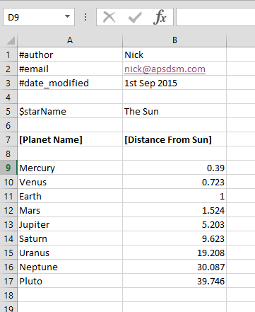

# DataHelpers Documentation

## What is this?

This package provides helper classes designed to make it easier to validate and import data from Excel spreadsheets into your custom Unity ScriptableObject assets. The library uses [NPOI](https://npoi.codeplex.com/) which comes bundled in the `lib` directory.

This is not a programming-free solution. You can't drop this package into your project and expect to fiddle around with a few values and get it to work. You will need to create custom validator and importer classes that inherit from the classes included in this package, as well as a custom post processor that will use the included helper class.

I've set it up this way because when it comes to things like data importing, I prefer to keep things at the code level, rather than the settings level. That's just personal taste. Additionally and in any case, I wanted a validation layer, and I couldn't think of a good way to do that with sliders and knobs.

If I didn't feel that calling software libraries "opinionated" is just a cheap way of saying the library isn't flexible, this would definitely fall under the category of "opinionated". As is I'll just say it now: This library is not flexible, and if you use it, you'll have to do things the way that is explained below. It's also coded in C# because come on seriously.

If you're not cool with any of the above, then you're not using the right library. Here is an alternative you might prefer: 

- https://github.com/tsubaki/Unity-Excel-Importer-Maker

## Unfinished Software Warning!

This is not finished software - this library is actively being developed, and is probably going to improve as time goes on. Use at your own risk. Also, right now it's set to spit out a lot of debug data, so don't be concerned if your debug console seem unusually verbose.

## Changes

### v0.2

- you don't need to pass an array of field names any more. These are now calculated automatically by the importer when it gets a new spreadsheet.
- added an auto import method for simple data types

### v0.1

- initial version

## How it works

The system is made up of three major parts.

### AssetPostProcessor class

This class provides helper methods that allow a user created AssetPostprocessor to easily validate and import data contained in tabular data storage file types (like an excel document or a TSV file).

The user created postprocessor calls the helper class's `Import` method, providing the type references for an asset type, an importer type, and a validator type.

It's up to the user to make sure the importer and validator are compatible.

The helper class will then call the correct reader method, send parsable data to the validator, and if validation passes will finally send that data on to the data importer.

### Validator class

The second part is the Validator class. This is an abstract class that provides base functionality for validating data that has been collected by the postprocessor helper. 

The actual validation methods are filled in by the developer, and can be whatever is required to make sure data is valid.

### Importer class

The third part is the Importer class. This is an abstract class that provides base functionality for importing validated data into a game object. 

The actual method for copying data from the array of valid data into the game asset must be filled in by the developer, and can be whatever is required to get data into the game.

## Example of a working import workflow

To begin with, let's say we have a simple Serializable class `Planet`, and a ScriptableObject called `SolarSystem`.

```csharp

[System.Serializable]
class Planet {
    public string name;
    public float distanceFromSun;
}

[System.Serializable]
class SolarSystem : ScriptableObject {
    public List<Planet> planets;
}

```

The goal here is that we want to have a spreadsheet that contains a list of planets that we can import into a `SolarSystem` asset file. Let's start by defining what the spreadsheet should look like.

In each spreadsheet that is parsed, a row can either designated as meta data, a variable, a title, or a parseable row.

**meta data** is intended to be used in the spreadsheet itself, and is not data that is required by the asset in any way. This might be the author of the spreadsheet, or the last date that the sheet was updated. Any rows that starts with a `#` is considered meta data

**variables - not implemented yet** are interpreted as simple values that will be stored and passed to the object without being tied to any specific parsable row. This could be a good place to add data which is non-repeating but needs to be set in the object. Any row that starts with a `$` is considered a variable.

**titles** are rows that have information about what each cell is supposed to contain, and these are not parsed or used in any way by the system. And row that starts with a `[` is considered a title. When the importer finds a row of titles, it will use these names (without the square brackets) as the column names, which can be used for your validations.

**parseable rows** are rows of tabular data that will be fed into the validator and importer. Any row that isn't blank, and that doesn't start with one of the control characters above, will be treated as parseable data.

A spreadsheet that contains information for the `SolarSystem` class might look something like this:



In this sheet, the `#author`, `#email` and `#date_modified` fields will be ignored. The `$starName` will technically also be ignored, but one day it will be passed as a variable.

The row starting with `[Planet Name]` will be the names of the fields that are referenced by the Importer and the Validator

Everything below that will be treated as parsable data that can be imported.

So, to import this data, there are three more classes we need to define. The first is our validator.

```csharp

public class SolarSystemValidator : Validator 
{

    void Validate( ValidatorNode node ) 
    {

        // must have name
        if (node[ "Planet Name" ] == "") {
            SetErrorMessage(node, "planets must have a name");
            return;
        }

        // must have distance
        if (node[ "Distance From Sun" ] == "") {
            SetErrorMessage(node, "planets must have a distance");
            return;
        }

        // must have valid distance
        float distance = node.AsFloat( "Distance From Sun" );

        if (distance < 0.0f) {
            SetErrorMessage(node, "cannot have distance less than 0");
            return;
        }
    }
}

```

The important things to note are:

- there must be `Validate` method that takes a `ValidatorNode` as its parameter.
- validation is on a per-parseable-row basis. The node will contain the cells for each row.
- if an error is encountered, set the error using the `SetErrorMessage` function, then stop processing.
- all data is stored as strings
- get data converted into other types using
    - AsFloat("fieldName") to get a float
    - AsInt32("fieldName") to get an int
    - AsBool("fieldName") to get a bool

Your validation can technically get as fancy as you want. Each validator node will come with a set of fields that are accessible by using the brackets operator together with the string form name of the field - **note that the names of the fields are set in the custom post processor class, and have nothing to do with any title rows you may have defined in the spreadsheet!**

Now that the validator is written, we need to write a data importer.

```csharp

public class SolarSystemImporter : Importer<SolarSystem> 
{
    void CopyDataToAsset(SolarSystem asset, ReadBundle readBundle) 
    {
        // whatever set up the asset requires
        asset.planets = new List<Planet>();

        // set up each new planet, then add it to the solar system
        foreach (ValidatorNode node in readBundle.validatedNodes) {

            Planet p = new Destination();

            p.name = node[ "Planet Name" ];
            p.distanceFromSun = node.AsFloat( "Distance From Sun" );

            asset.destinations.Add(p);
        }
    }
}

```

The important things to note are:

- The class must derive from `Importer` and must pass the type of asset it is responsible for
- the class must define a `CopyDataToAsset` method that takes an asset of the same type this importer is responsible for, and a `ReadBundle` object. The `ReadBundle` is how information about the spreadsheet is passed around. The validated nodes can be found in a list called `validatedNodes` inside the `ReadBundle`.

After that, it's up to you to parse each of the nodes into the asset any way you see fit. The asset will automatically be written to a location in your assets folder (see below for more info on where, exactly).

With the validator and Importer written, the last thing to do is to write the custom postprocessor.

```csharp

public class DestinationListPostProcessor : AssetPostprocessor {

    private static void OnPostprocessAllAssets(string[] importedAssets,
                                               string[] deletedAssets,
                                               string[] movedAssets,
                                               string[] movedFromPath) 
    {
        foreach (string asset in importedAssets) 
        {
            if (asset.Contains(".solarsystem.")) 
            {
                PostprocessorHelper.Import<SolarSystem, SolarSystemImporter, SolarSystemValidator>( asset );
            }
        }
    }
}

```

Important things to note:

- the class must inherit from AssetPostProcessor
- the name and parameters of the static method must match the example. That's a Unity thing.
- you need to define the names of the fields yourself, and this is a good place to do it.
- when you call the `PostprocessorHelper` you need to supply the type of the asset, of its validator, and of its importer, as well as the asset location.
- the field names are calculated based on what's in your spreadsheet.

If you want more info on how this part works, first of all make sure you read and grasp what's being said in the [Unity documentation for the AssetPostprocessor](http://docs.unity3d.com/ScriptReference/AssetPostprocessor.html).

This is basically a custom post processor that is searching for a specific string in the file names of every imported (or modified) asset. In this case we search for anything that has `.solarsystem.` in the name - running on the assumption that if we will name our Excel files something like `myplanets.solarsystem.xlsx` - but you're free to search for your asset data any way you want.

After you have these elements set up in your system, you should be able to drag and drop Excel files into your project and have them automatically validated and imported.

## Automating the Import method using field attributes

In version 0.2 there is also a slightly easier way to import long lists of data. This is based on the assumption that you're importing a spreadsheet where each row is a representation of a single object that is stored in a `List` of similar objects.

There is now a `CopyReadBundleIntoList` method available from any inherited `Importer` obejct, which will automate the process of copying data, so long as you have added a few custom attributes to your asset definition.

The attributes are `DIColName` and `DICopyMethod`.

`DIColName` allows you to specify the column name in the spreadsheet that will be used as the source to populate the specific field to which it is attached. the type of data that is currently supported is `float` and `string`, with more to come next release.

If the type of data to be imported isn't supported or a standard type, then you can use the `DICopyMethod` and specify a method in your importer that will be invoked to copy data from the source `ValidationNode` over to the asset.

The method which is declared using the `DICopyMethod` attribute must take a string as the first parameter (this is how all data is stored in a Validation Node) and it must take a reference to the asset type as the second parameter.

To make an example using the previous Planet class, let's say we add the attributes to the existing fields, but also add a new field called `PlanetType`, which could be some kind of `enum`:


```csharp

[System.Serializable]
class Planet {

    [ DIColName ( "Planet Name" ) ]
    public string name;

    [ DIColName ( "Distance From Sun" ) ]
    public float distanceFromSun;

    [ DIColName ( "Planet Type" ) ]
    [ DICopyMethod ( "CopyPlanetType" ) ]
    public PlanetType planetType;
}

[System.Serializable]
class SolarSystem : ScriptableObject {
    public List<Planet> planets;
}

```

Now we can update our Importer class to look like this:

```csharp

public class SolarSystemImporter : Importer<SolarSystem> 
{
    void CopyDataToAsset(SolarSystem asset, ReadBundle readBundle) 
    {
       CopyReadBundleIntoList( readBundle, ref asset.planets );
    }

    void CopyPlanetType( string type, Planet planet)
    {
        // do something with the planet and type variables ...
    }
}

```


## What source data types are supported?

At the moment only Excel files saved as `.xlsx` are supported. Any other file format or suffix and it won't import. I don't really see myself adding support for other data types unless I really need to, but the system is set up in such a way that other data types *could* be added if need be.

## Where files are copied

The end location for the target asset that is generated by the assetpostprocessor helper is decided as follows:

1. The first directory after the Asset folder will be deemed the import folder.
2. The import folder is replaced with the ‘Resources’ folder. For example, `Assets/XLSX/Test1/Test2` will become `Assets/Resources/Test1/Test2`
3. The extension at the end of the file name will become `.asset`. For example, `dates.xlsx` will become `dates.asset`

This means that the user can control the location of the destination file by creating an appropriate folder structure underneath whatever their import folder is.

This also means that you can either choose to keep all your data seperate from your assets (by putting them in a specifically named folder outside your Resources folder) or you can choose to keep them together by just leaving the data files together in the Resource folder (in which case the assets will be generated alongside the data file)
